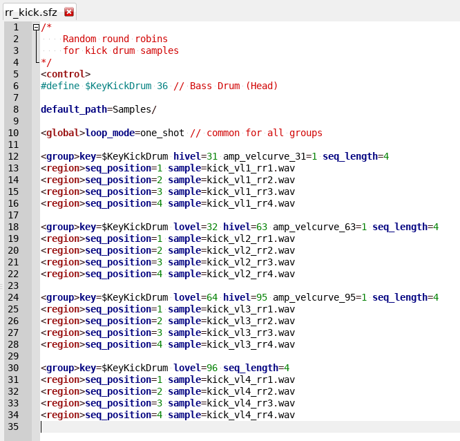

# SFZ Format Filetype Syntax Highlighting for Geany

These [Geany](https://www.geany.org/) configuration files will add a syntax
highlight for [SFZ Format](https://sfzformat.com) file editing.

## Installation

- Copy or add to existant `filetype_extensions.conf` in `$HOME/.config/geany`
- Copy `filetypes.SFZ.conf` in `$HOME/.config/geany/filedefs`

## Known Bugs

- Opcodes using wildcards or numbers are not recognized
	(`egN_`, `lfoN_`, `hint_*`, `vN`, `varNN`)

- Defined `$variables` are not highlighted

- `<group>` header is highlighted as `group` opcode

